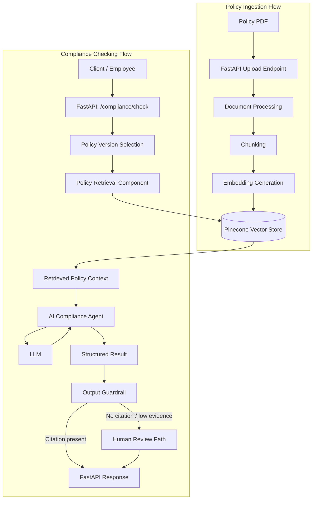

# Expense Policy Compliance Checker — System Architecture Document

## 1. Architecture Overview

The Expense Policy Compliance Checker is a **FastAPI-based service with an AI agent and a RAG (Retrieval-Augmented Generation) pipeline**.

The system has two main flows:

1. **Policy Ingestion Flow** — a company policy document is uploaded, processed, split into chunks, converted into embeddings, and stored in Pinecone so it can be searched later.
2. **Compliance Checking Flow** — an expense claim is submitted, the relevant policy content is retrieved from Pinecone, an AI agent evaluates the expense against that retrieved content, and a structured, citation-backed result is returned.

FastAPI acts as the entry point for both flows. Behind FastAPI, dedicated components handle document processing, retrieval, AI reasoning, and result validation. No component skips the retrieval step — the AI agent never evaluates an expense without first being given the actual, relevant policy text.

---

## 2. Architecture Goals

- **Policy-grounded decisions** — every verdict comes from real policy text, never from the model's general knowledge.
- **Reliable retrieval** — the system consistently finds the policy content relevant to a given expense.
- **Citation-backed compliance results** — no verdict is returned without a supporting policy clause.
- **Support for policy versions** — the system correctly applies the policy version that was in effect for a given expense.
- **Structured outputs** — every response follows a consistent, predictable shape.
- **Clear separation of responsibilities** — each component does one job (retrieval, reasoning, validation, etc.).
- **Human review for uncertain cases** — the architecture routes unclear or approval-required cases to a human path instead of forcing an automatic decision.
- **Maintainability** — components can be updated (e.g., a new policy version added) without redesigning the whole system.

---

## 3. High-Level System Components

| # | Component | Receives | Produces | Talks To |
|---|---|---|---|---|
| 1 | **FastAPI API Layer** | HTTP requests (policy uploads, expense checks, lookups) | HTTP responses | All other components |
| 2 | **Policy Ingestion Pipeline** | An uploaded policy document + effective date | A processed, storable set of policy chunks | Document Processing Layer, Embedding Layer |
| 3 | **Document Processing Layer** | Raw policy document | Extracted, cleaned text split into chunks | Policy Ingestion Pipeline, Embedding Layer |
| 4 | **Embedding Layer** | Text chunks | Vector embeddings of each chunk | Document Processing Layer, Pinecone Vector Store |
| 5 | **Pinecone Vector Store** | Embeddings + metadata (for storage), or a query vector (for search) | Stored vectors, or the most relevant matching chunks | Embedding Layer, Policy Retrieval Component |
| 6 | **Policy Retrieval Component** | An expense claim + applicable policy version | The relevant policy chunks for that expense | Pinecone Vector Store, AI Compliance Agent |
| 7 | **AI Compliance Agent** | Expense claim + retrieved policy chunks | A structured compliance result (draft) | Policy Retrieval Component, LLM, Structured Output Model |
| 8 | **LLM** | A reasoning request from the agent, grounded in retrieved policy text | Reasoned judgment used to build the structured result | AI Compliance Agent |
| 9 | **Structured Output / Result Model** | Raw agent output | A validated, typed compliance result | AI Compliance Agent, Output Guardrail |
| 10 | **Output Guardrail** | The structured result | An approved result, or a blocked/corrected outcome | Structured Output Model, FastAPI API Layer |
| 11 | **Policy Version / Metadata Handling** | Policy version and effective-date information | The correct applicable policy version for a given expense | Policy Ingestion Pipeline, Policy Retrieval Component |
| 12 | **Human Review Path** | Cases flagged as needing approval or having insufficient evidence | A routed "needs review" outcome instead of a forced verdict | AI Compliance Agent, Output Guardrail, FastAPI API Layer |

---

## 4. High-Level Architecture Diagram

**In simple terms:** The top half shows how a policy document becomes searchable data. A PDF is uploaded, its text is extracted and split into chunks, each chunk is turned into an embedding, and everything is stored in Pinecone. The bottom half shows how an expense claim becomes a compliance answer. The claim comes in through FastAPI, the system picks the right policy version, retrieves the matching policy chunks from Pinecone, and passes them to the AI agent. The agent reasons using the LLM and produces a structured result. Before that result goes back to the client, the output guardrail checks it — if it lacks a citation or the evidence is weak, the case goes to the human review path instead of being sent back as a confident verdict.

---

## 5. Policy Ingestion Architecture

The ingestion flow prepares a policy document so it can be searched later:

1. **Policy document upload** — an administrator uploads a policy file (e.g., PDF) along with its effective date, through `POST /policy/upload`.
2. **Document loading** — the Document Processing Layer opens the file and reads its raw content.
3. **Text extraction** — readable text is extracted from the document.
4. **Text chunking** — the extracted text is split into smaller, manageable sections so retrieval can later match specific clauses instead of whole documents.
5. **Embedding generation** — the Embedding Layer converts each chunk into a vector representation.
6. **Metadata creation** — each chunk is tagged with information needed to identify it later.
7. **Storage in Pinecone** — the embeddings and their metadata are stored in the Pinecone Vector Store.
8. **Policy version information** — the policy version and its effective date are recorded so the correct version can be selected during a future compliance check.

**Why metadata matters for retrieval:** metadata is what lets the system narrow a search down to the right policy content. At minimum, the architecture needs each stored chunk to carry:

- **Policy version** — which version of the policy this chunk belongs to
- **Effective date** — when that policy version applies
- **Source document** — which uploaded document the chunk came from
- **Clause/section information** — enough detail to identify and later display the specific clause

The exact metadata schema (field names, storage format) is a Technical Specification concern. Architecturally, what matters is that this information travels with the chunk from ingestion through to retrieval and citation.

---

## 6. Compliance Checking Architecture

1. Client sends an expense claim to `POST /compliance/check`.
2. FastAPI validates the incoming request.
3. The system determines the applicable policy version, using the expense's relevant date and the stored policy version/effective-date information.
4. The expense details are used to build a retrieval query.
5. The Policy Retrieval Component queries Pinecone and retrieves the policy chunks relevant to the expense, scoped to the applicable policy version.
6. The retrieved policy content is passed to the AI Compliance Agent as its evidence.
7. The agent evaluates the expense strictly against the retrieved policy content, using the LLM to reason.
8. The agent produces a structured output (compliance status, explanation, citation, policy version).
9. The Output Guardrail checks the result before it leaves the system.
10. A valid result is returned to the client through FastAPI.

**Handling different outcomes:**

- **Relevant policy information is found and clearly applies** → the agent returns a **Compliant** or **Non-Compliant** verdict with a citation.
- **Policy is silent** → the agent returns **"Policy is silent on this"** instead of forcing a verdict; no citation is required for this outcome.
- **Retrieved evidence is insufficient** → no verdict is produced; the case is routed to the **Human Review Path**.
- **Policy requires approval** → the agent returns **Needs Approval / Human Review**, with a citation to the clause requiring approval.
- **Output has no citation** → the Output Guardrail blocks the result from being returned as a compliance verdict and routes the case to human review instead.

---

## 7. RAG Architecture

The RAG pipeline for this project follows these stages:

**Document → Chunking → Embedding → Pinecone → Retrieval → Policy Context → AI Agent → Result**

- **Document** — the uploaded policy file.
- **Chunking** — the document is split into smaller sections so retrieval can be precise.
- **Embedding** — each chunk is converted into a vector so it can be compared for relevance.
- **Pinecone** — stores the embeddings and enables similarity search.
- **Retrieval** — given an expense, the system searches Pinecone for the most relevant chunks.
- **Policy Context** — the retrieved chunks become the evidence given to the agent.
- **AI Agent** — reasons over that evidence, not over its own general knowledge.
- **Result** — a structured, citation-backed compliance decision.

**Why retrieval instead of sending the whole policy every time?** Policy documents can be long (tens of pages). Sending the entire document on every request is inefficient and makes it harder for the model to focus on the parts that actually matter. Retrieval narrows the input down to the specific clauses relevant to the expense being checked, which keeps the agent's reasoning grounded, focused, and traceable back to a specific source.

---

## 8. Policy Version Architecture

- The system can store **multiple policy versions**, each representing the company's policy as it stood at a point in time.
- Each version has an **effective date**, recorded during ingestion.
- When a compliance check runs, the system must determine which policy version was actually applicable — based on the relevant date for the expense — rather than assuming the latest upload is always correct.
- The Policy Retrieval Component scopes its search to the applicable version, so retrieval never mixes content from two different policy versions in a single check.
- An older policy version remains available and usable if it was the version in effect at the relevant time, even after a newer version has been uploaded.

The exact storage design (e.g., how versions are indexed or separated within Pinecone) is left to the Technical Specification. Architecturally, version and effective date are treated as first-class information that travels alongside every stored chunk and every retrieval query.

---

## 9. Citation Architecture

Citation support is built into the architecture, not left to a prompt instruction alone:

- Every chunk stored in Pinecone carries enough metadata to identify its source clause, so retrieved content can always be traced back to where it came from.
- The AI Compliance Agent is given only retrieved policy evidence and is required to base its verdict on that evidence.
- The Structured Output / Result Model requires a citation field for any compliance verdict (Compliant, Non-Compliant, Needs Approval).
- The Output Guardrail checks that a citation is present before a verdict is allowed to reach the client.
- The cited clause is stored so it can later be retrieved on its own through `GET /compliance/{id}/clause`.
- If there is no supporting evidence, the architecture does not allow a compliance verdict to be produced — the flow instead resolves to "Policy is silent" or the Human Review Path.

---

## 10. Output Guardrail Architecture

The guardrail sits directly between the AI agent's output and the API response:

**AI Agent → Structured Result → Output Guardrail → Final API Response**

Its role is to check the structured result before it is returned to the client, specifically verifying that:

- A compliance verdict (Compliant, Non-Compliant, Needs Approval) always includes a supporting policy citation.
- Results without a citation are not passed through as a confident verdict.

**What happens when the guardrail fails a result:** the result is not returned to the client as-is. Instead, the case is routed to the **Human Review Path**, so the client receives an honest "needs review" outcome rather than an unsupported compliance decision.

This document describes only the guardrail's placement and role in the flow. Its internal logic will be defined in the Technical Specification.

---

## 11. Human Review Architecture

The Human Review Path is reached from more than one point in the flow, covering:

- **Approval-required expenses** — the policy itself states that this type of expense needs sign-off.
- **Insufficient evidence** — retrieval did not return enough relevant policy content to support a confident verdict.
- **Policy silence** — handled as its own explicit outcome, but may also be routed for human follow-up when appropriate.
- **Unsafe automatic decisions** — any case where the Output Guardrail rejects the result (e.g., missing citation).

Architecturally, the Human Review Path is a **first-class destination**, not an error state. It receives the same case information (expense details, retrieved policy context if any, and the reason review is needed) so that a human reviewer has what they need to make a decision.

---

## 12. API Layer Architecture

FastAPI is the single entry point into the system. It routes each request to the appropriate internal components.

| Endpoint | Talks To | High-Level Flow |
|---|---|---|
| `POST /policy/upload` | Policy Ingestion Pipeline → Document Processing Layer → Embedding Layer → Pinecone Vector Store | Accepts a policy document and effective date, triggers ingestion, and stores the resulting chunks in Pinecone. |
| `POST /compliance/check` | Policy Version / Metadata Handling → Policy Retrieval Component → Pinecone → AI Compliance Agent → Output Guardrail | Accepts an expense claim, retrieves relevant policy content, runs the agent, validates the result, and returns a structured compliance response. |
| `GET /compliance/{id}/clause` | Stored compliance result / citation data | Returns the specific policy clause that supported a previously produced compliance result. |
| `GET /policy/versions` | Policy Version / Metadata Handling | Returns the list of available policy versions and their effective dates. |

Detailed request and response schemas are out of scope for this document and will be defined in the Technical Specification.

---

## 13. External Services and Dependencies

| Technology | Role |
|---|---|
| `FastAPI` | API/service layer that exposes the system's endpoints and coordinates the internal components. |
| `OpenAI Agents SDK` | Defines and runs the AI Compliance Agent, including its structured output and guardrail behavior. |
| `LLM` | Performs the reasoning over retrieved policy content to reach a compliance judgment. |
| `LangChain` | Handles document loading, text splitting, and embedding generation during policy ingestion. |
| `Pinecone` | Vector database used to store policy embeddings and perform similarity search during retrieval. |

---

## 14. Data Flow Summary

### Policy Flow
Policy Document → Upload → Processing → Chunking → Embeddings → Pinecone

The policy document is uploaded, its text is processed and split into chunks, each chunk is embedded, and the result is stored in Pinecone so it can be searched later.

### Expense Flow
Expense Claim → API → Policy Version Selection → Retrieval → Pinecone → Retrieved Policy Evidence → AI Agent → Structured Result → Citation Guardrail → Final Response

An expense claim enters through the API, the correct policy version is identified, relevant policy evidence is retrieved from Pinecone, the AI agent reasons over that evidence to produce a structured result, the guardrail checks for a supporting citation, and the final response is returned to the client.

---

## 15. Architecture Decisions

| Decision | Reason |
|---|---|
| **FastAPI for the service/API** | Provides a straightforward way to expose the system as a typed, structured HTTP service rather than a chatbot interface. |
| **RAG for policy-grounded decisions** | Ensures compliance verdicts are based on actual policy text rather than the model's general knowledge. |
| **LangChain for document processing** | Handles loading, splitting, and embedding of policy documents as part of the ingestion pipeline. |
| **Pinecone for vector retrieval** | Enables fast, meaning-based search over policy content, which is needed because policies are long and clause-matching by keyword alone is unreliable. |
| **OpenAI Agents SDK for the agent** | Provides the agent framework, structured output support, and guardrail mechanism used to reason over retrieved policy evidence. |
| **Structured output for predictable results** | Ensures every compliance result follows a consistent, typed shape instead of free-form text. |
| **Output guardrail for citation enforcement** | Guarantees that no compliance verdict reaches the client without supporting policy evidence. |
| **Human review for uncertain or approval-required cases** | Keeps the system honest by routing cases it cannot safely decide to a person, instead of forcing an automatic answer. |

---

## 16. Security and Reliability Considerations

- **Secure handling of company policy documents** — uploaded policy files may contain internal company information and should be stored and accessed securely.
- **Validation of uploaded documents** — documents should be checked for basic validity (e.g., readable format) before being processed.
- **Avoiding unsupported AI decisions** — the architecture is built so the agent cannot return a compliance verdict without retrieved policy evidence.
- **Citation enforcement** — the output guardrail acts as a reliability check, preventing unsupported results from reaching users.
- **Handling retrieval failures** — if Pinecone retrieval fails or returns no relevant content, the system should not silently continue; it should resolve to "Policy is silent" or the Human Review Path.
- **Handling invalid input** — malformed or incomplete requests should be rejected with clear errors at the FastAPI layer, before reaching internal components.
- **Keeping policy versions separated correctly** — retrieval must not mix content from different policy versions when answering a single expense check.
- **Avoiding accidental use of outdated policies** — the system must actively select the applicable version rather than defaulting to the most recently uploaded one.

---

## 17. Architecture Boundaries

This document defines the high-level structure of the system only. It does **not** yet cover:

- Detailed database schema
- Detailed API request/response schemas
- Exact folder/file structure
- Exact Python classes, functions, or Pydantic models
- Deployment infrastructure
- Authentication implementation
- Complete testing strategy

These details will be defined in the **Technical Specification**, which will build directly on this architecture and on `docs/PRD.md`.
